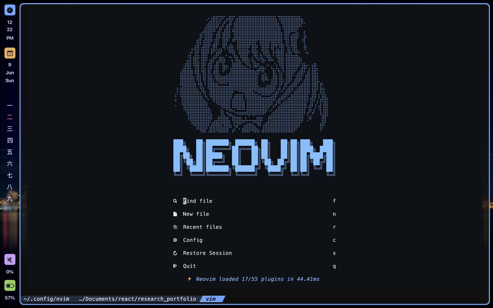
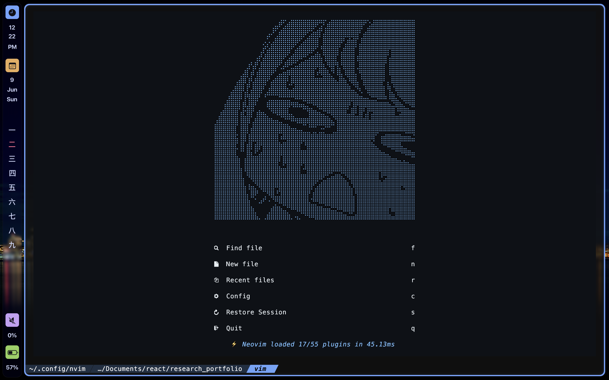
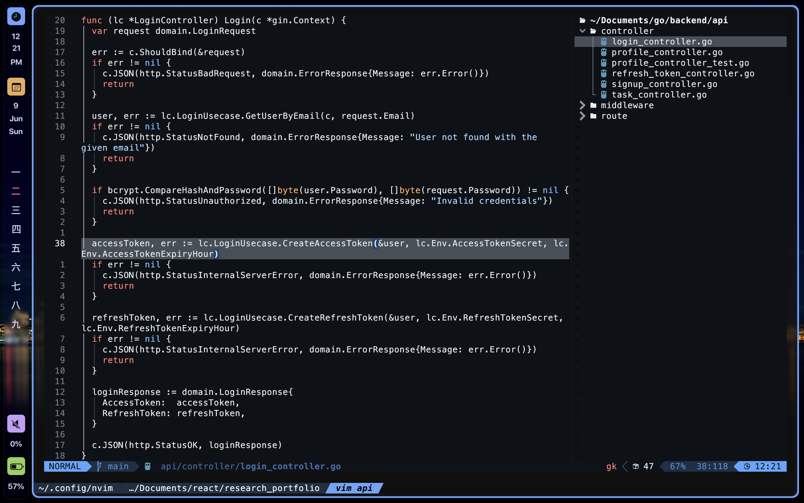
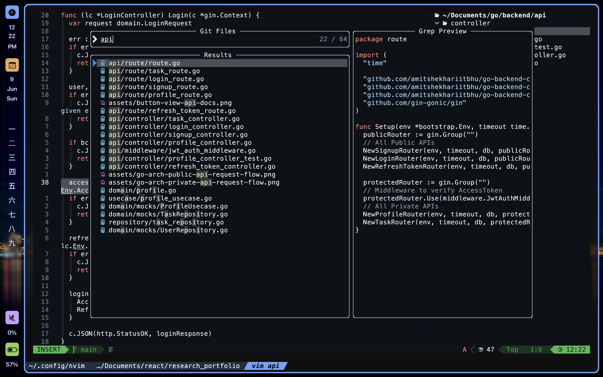
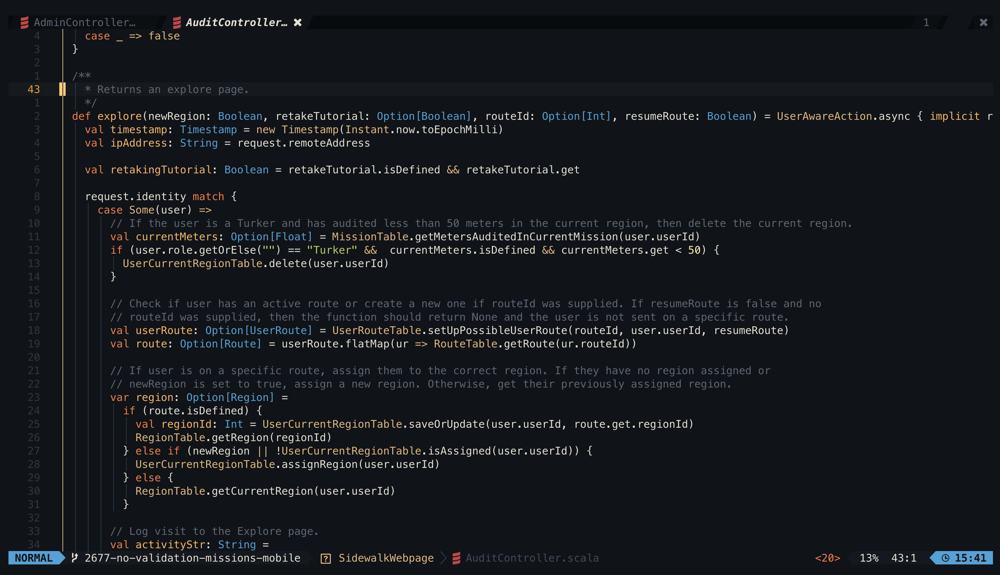

# ANYA-VIM

A neovim distribution that is very waku waku.

I'm sorry, I was bored.

## Dashboard

- Dashboard randomly generates an Anya face









## Installation

1. Backup your current configurations for Neovim

```
# required
mv ~/.config/nvim{,.bak}

# optional but recommended
mv ~/.local/share/nvim{,.bak}
mv ~/.local/state/nvim{,.bak}
mv ~/.cache/nvim{,.bak}
```

2. Clone the repo

Using http:

```
git clone https://github.com/justyeethan/AnyaVim.git
```

Using ssh:

```
git clone git@github.com:justyeethan/AnyaVim.git
```

3. Start neovim

```
nvim
```

4. Check the health of your installation

```
:checkhealth
```

## Colorscheme

- Ayu Dark



## Modifications

Plugin modifications can be found in lua/plugins/plugins.lua and inside the if statement. There is also a reference to Lazy-vim's default configurations for further examples.

To configure neovim itself, you can find all configuration files inside lua/config.

For neovim keymap configuration changes, you should be calling the map() function that has already been declared, and any other plugins should follow the same structure.

The ASCII art that makes Anya-vim is located inside lua/anyaVim.lua, where it randomly selects a random Anya. You can change this to really match any ascii art you would like.
