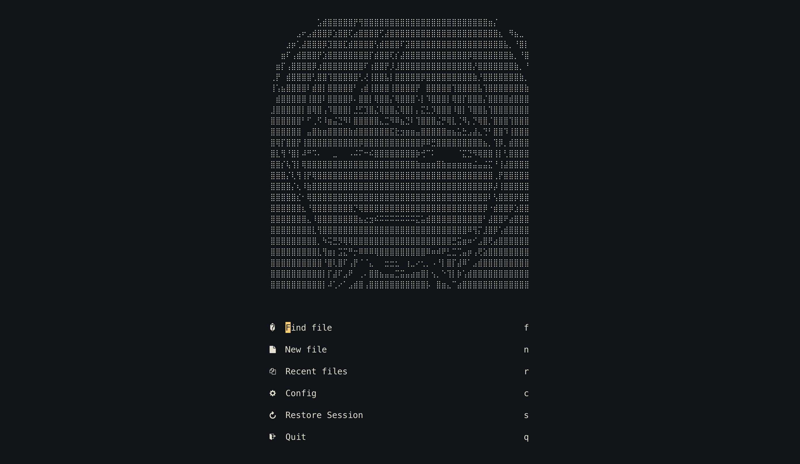
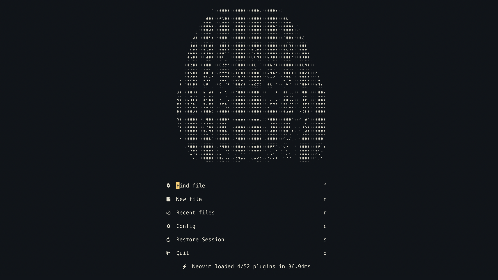
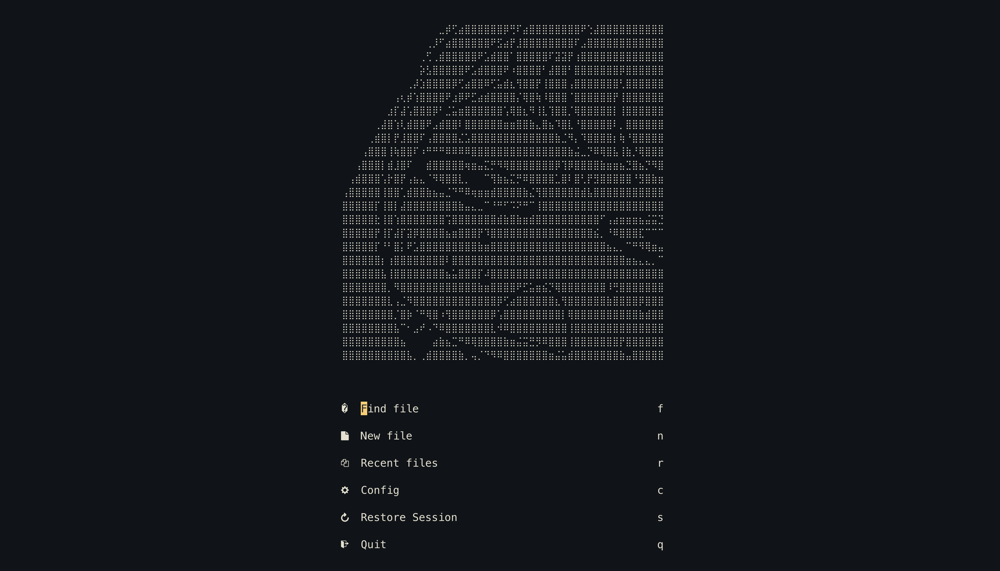

# ANYA-VIM

A neovim distribution that is very waku waku.

I'm sorry, I was bored.

## Dashboard

- Dashboard randomly generates an Anya face








## Installation

1. Backup your current configurations for Neovim

```
# required
mv ~/.config/nvim{,.bak}

# optional but recommended
mv ~/.local/share/nvim{,.bak}
mv ~/.local/state/nvim{,.bak}
mv ~/.cache/nvim{,.bak}
```

2. Clone the repo

Using http:

```
git clone https://github.com/justyeethan/AnyaVim.git
```

Using ssh:

```
git clone git@github.com:justyeethan/AnyaVim.git
```

3. Start neovim

```
nvim
```

4. Check the health of your installation

```
:checkhealth
```

## Colorscheme

- Ayu Dark


